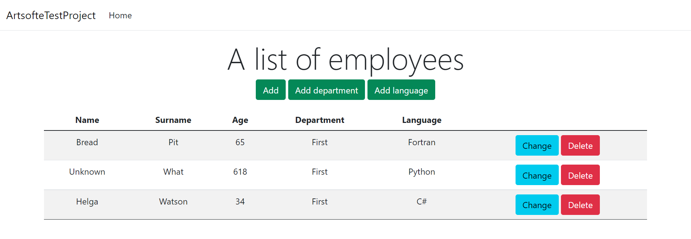
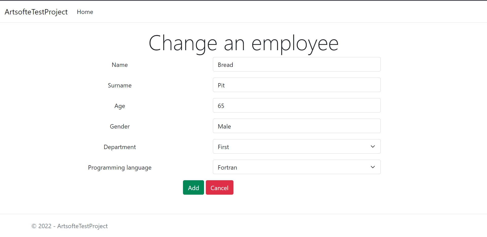
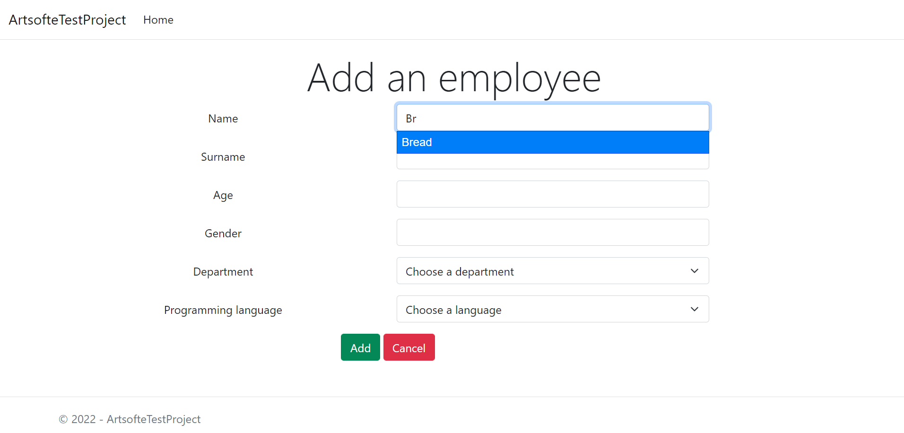
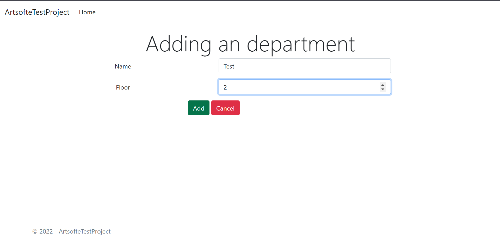
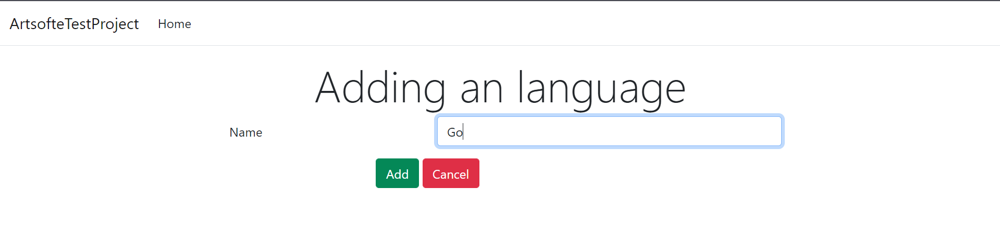

# ArtsofteTestProject (Ruby version)

## [Version on C#](https://github.com/michaellux/ArtsofteTestProject)

## Solution

### Project setup

rails db:create

rails db:migrate

rails db:seed

### Project launch

rails server

